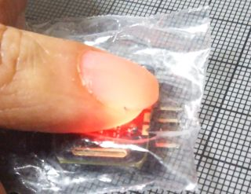

# Simple SpO2 plotter for MH-ET LIVE MAX30102
Using Sparkfun MAX3010X library
  https://github.com/sparkfun/SparkFun_MAX3010x_Sensor_Library

Shows SpO2 and the user's heart beat on Arduino's serial plotter.
  No display hardware is required.
  This program should not be used for medical purposes.
  I wrote this to learn how SpO2 can be measured and pay tributes for the inventors.

## about SpO2 and pulse oximeter
  Peripheral oxygen saturation (SpO2) is an estimation of the oxygen saturation level usually measured with a pulse oximeter device.
  https://en.wikipedia.org/wiki/Oxygen_saturation_(medicine)
  https://en.wikipedia.org/wiki/Pulse_oximetry
  Pulse oximetry was developed in 1972, by Dr.Takuo Aoyagi and Michio Kishi,
  bioengineers, at Nihon Kohden in Japan.
  https://ethw.org/Takuo_Aoyagi

## Tips:
  SpO2 is calicurated as R=((square root means of RED/ RED average )/((square root means of IR)/IR average))
  SpO2 = -23.3 * (R - 0.4) + 100;
  taken from a graph in http://ww1.microchip.com/downloads/jp/AppNotes/00001525B_JP.pdf

  Since MH-ET LIVE MAX30102 breakout board seems outputting IR and RED swapped.
  red = particleSensor.getFIFOIR();
  ir = particleSensor.getFIFORed();
  is used in my code. If you have Sparkfun's MAX30105 breakout board , try to
  correct these lines. 

## Instructions:

  0) Install Sparkfun's MAX3010X library
  1) Load code onto ESP32 with MH-ET LIVE MAX30102 board
  2) put MAX30102 board in plastic bag , insulating from your finger
     and attach sensor to your finger tip
  3) Run this program by pressing reset botton on ESP32
  4) Wait for 3 seconds and Open Arduino IDE Tools->'Serial Plotter'
     Make sure the drop down is set to 115200 baud
  5) Search the best position and pressure for the sensor by watching
     the blips on Arduino's serial plotter
     I recommend to place LED under the backside of nail and wrap you
     finger and the sensor by rubber band softly.

  5) Checkout the SpO2 and blips by seeing serial plotter
     100%,95%,90%,85% SpO2 lines are always drawn on the plotter

## Hardware Connections (Breakoutboard to ESP32 Arduino):
  -VIN = 3.3V
  -GND = GND
  -SDA = 21 (or SDA)
  -SCL = 22 (or SCL)
  -INT = Not connected

## Trouble Shooting:
  Make sure to solder jumper on 3V3 side. 
  if you forget this, I2C does not work and can not find MAX30102.
  says "MAX30102 was not found. Please check wiring/power."
  

### LICENSED under Apache License 2.0

